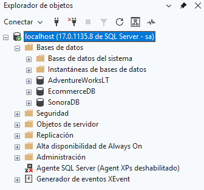
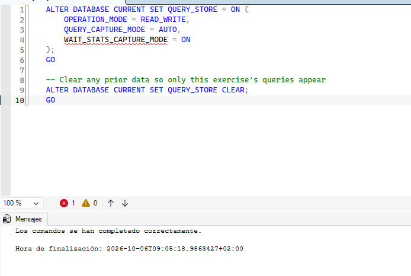
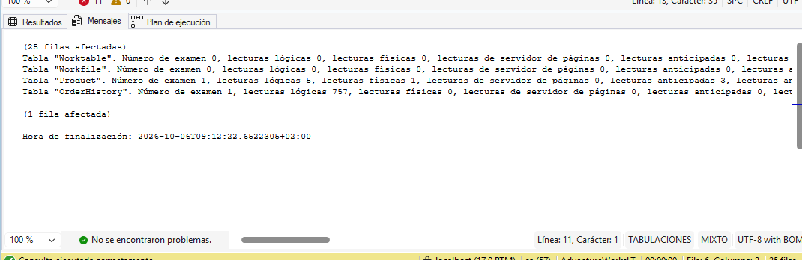
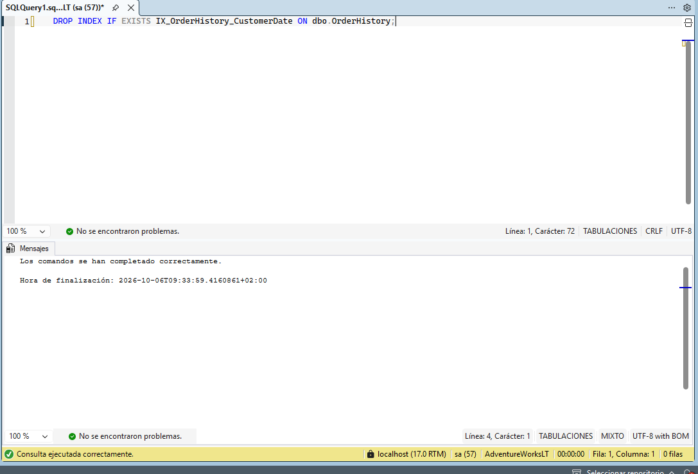
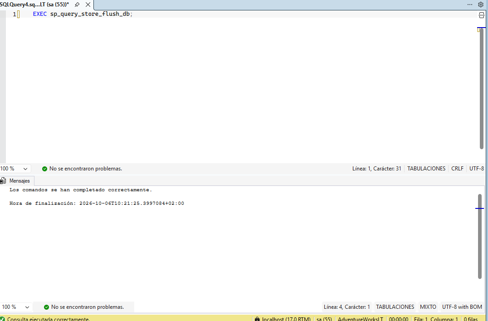

# Laboratorio 06: Optimizar el rendimiento de las consultas

**Objetivo:** Identificar problemas de rendimiento en consultas SQL, revisar planes de ejecución, y aplicar optimizaciones mediante la creación de índices.
**Base de datos:** AdventureWorksLT

---

## Paso 1: Crear la carga de trabajo de prueba (Test Workload)

Primero, creamos la tabla `dbo.OrderHistory` y la llenamos con datos de prueba (80,000 registros) para simular un historial de pedidos grande.

```sql
-- Ejecutar el script proporcionado en el laboratorio para crear y rellenar la tabla
DROP TABLE IF EXISTS dbo.OrderHistory;

CREATE TABLE dbo.OrderHistory (
    OrderID INT IDENTITY(1,1) PRIMARY KEY,
    CustomerID INT NOT NULL,
    OrderDate DATE NOT NULL,
    ProductID INT NOT NULL,
    Quantity INT NOT NULL,
    UnitPrice DECIMAL(18,2) NOT NULL,
    TotalAmount AS (Quantity * UnitPrice),
    Status VARCHAR(20) DEFAULT 'Completed'
);

-- (Aquí va el resto del script del laboratorio que hace el INSERT con el bucle WHILE)
```

>

---

## Paso 2: Limpieza de objetos conflictivos (Troubleshooting)

Como hubo un error previo al intentar crear el procedimiento almacenado porque ya existía una función con ese nombre, procedemos a eliminarla.

```sql
DROP FUNCTION IF EXISTS dbo.GetCustomerOrders;
```



---

## Paso 3: Analizar el rendimiento base con STATISTICS IO

Activamos las estadísticas de entrada/salida para ver cuántas lecturas lógicas realiza la base de datos antes de estar optimizada.

```sql
SET STATISTICS IO ON;

SELECT 
    oh.OrderID,
    oh.OrderDate,
    p.Name AS ProductName,
    oh.Quantity,
    oh.UnitPrice,
    oh.TotalAmount,
    oh.Status
FROM dbo.OrderHistory AS oh
INNER JOIN SalesLT.Product AS p
    ON oh.ProductID = p.ProductID
WHERE oh.CustomerID = 29485
    AND oh.OrderDate >= DATEADD(MONTH, -3, GETDATE())
ORDER BY oh.OrderDate DESC;

SET STATISTICS IO OFF;
```


---

## Paso 4: Crear el Procedimiento Almacenado

Encapsulamos la consulta anterior en un procedimiento almacenado para facilitar su ejecución repetida.

```sql
CREATE OR ALTER PROCEDURE dbo.GetCustomerOrders
    @CustomerID INT
AS
BEGIN
    SELECT 
        oh.OrderID,
        oh.OrderDate,
        p.Name AS ProductName,
        oh.Quantity,
        oh.UnitPrice,
        oh.TotalAmount,
        oh.Status
    FROM dbo.OrderHistory AS oh
    INNER JOIN SalesLT.Product AS p
        ON oh.ProductID = p.ProductID
    WHERE oh.CustomerID = @CustomerID
    ORDER BY oh.OrderDate DESC;
END;
```



---

## Paso 5: Revisar el Plan de Ejecución (Execution Plan)

Ejecutamos el procedimiento con el Plan de Ejecución Real (Actual Execution Plan) activado (Ctrl + M en SSMS) para identificar los cuellos de botella.

```sql
SET STATISTICS IO ON;
EXEC dbo.GetCustomerOrders @CustomerID = 29485;
SET STATISTICS IO OFF;
```


---

## Paso 6: Optimización - Creación del Índice

Basándonos en la recomendación del plan de ejecución, creamos un índice no agrupado (Nonclustered Index) en la columna `CustomerID` para evitar que SQL Server escanee toda la tabla.

```sql
CREATE NONCLUSTERED INDEX IX_OrderHistory_CustomerID 
ON dbo.OrderHistory (CustomerID)
INCLUDE (OrderDate, ProductID, Quantity, UnitPrice, Status);
```



---

## Paso 7: Comprobar la mejora de rendimiento

Volvemos a ejecutar el procedimiento almacenado para comparar los resultados con los obtenidos en el Paso 3 y Paso 5.

```sql
SET STATISTICS IO ON;
EXEC dbo.GetCustomerOrders @CustomerID = 29485;
SET STATISTICS IO OFF;
```


---
**Conclusión del Laboratorio:** 
Al crear el índice `IX_OrderHistory_CustomerID`, hemos optimizado la consulta reduciendo significativamente la carga de E/S (lecturas lógicas) y cambiando el método de búsqueda de un escaneo completo a una búsqueda por índice (*Index Seek*).